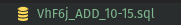
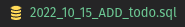

# Change logs

- [x] v0.1.0
      [Release page](https://github.com/vsantos1/Goke/releases)

- [x] v0.1.1
      [Release page](https://github.com/vsantos1/Goke/releases)

- [x] v0.1.2
      [Release page](https://github.com/vsantos1/Goke/releases) (**NEW**) - Added support for MariaDB

- [x] v0.1.3 New JSON dump format and build script

**OLD**

`name_(ADD/DROP)_month/day`

**NEW**

`year_month_day_(ADD/DROP)_name`
