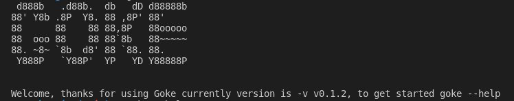
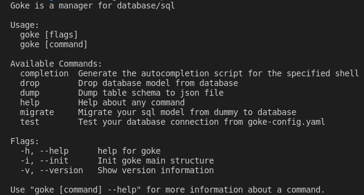
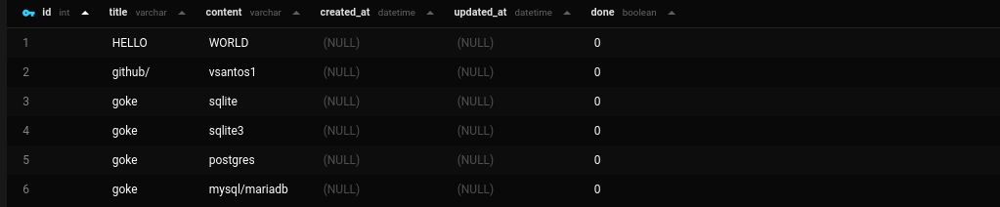
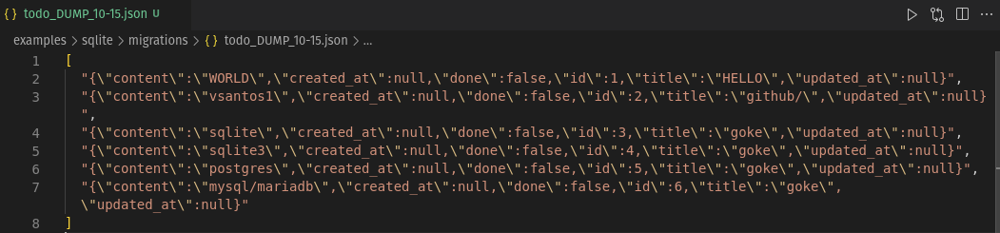
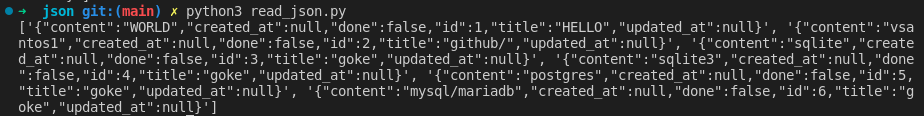
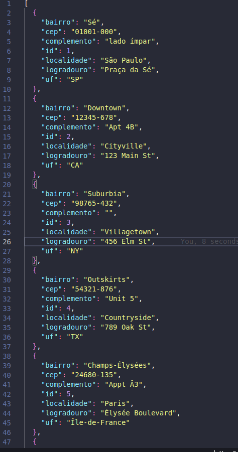
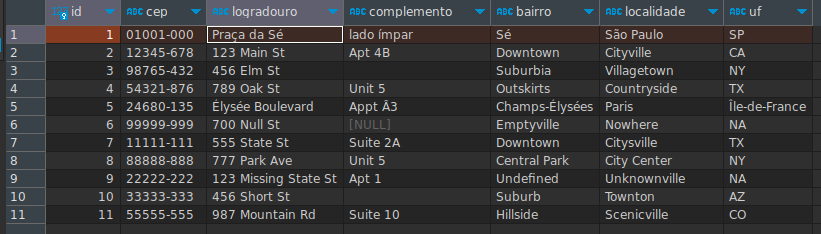
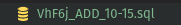
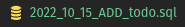

# GOKE 

#### A simple and useful CLI used for database management

## Descritpion

Goke is a CLI used for database management. It is written in Go and uses the SQL syntax. It is a simple and useful tool for database management, a simple command and migrate your SQL schema easily.

# Helpful examples

```shell
$ goke
```



```shell
$ goke --help
```



```shell
$ goke migrate
```

**NOTE**: Will generate a migration file with random shortname if you don't use the flag `-n` or `--name`, and current timestamp.

```shell
$ goke dump --json todo
```

## Old version (0.1.2)





The **JSON** is Readable?,
Yes, it is.

- JSON
  - Reading the JSON file with `PYTHON`:



## New version (0.1.3)





## How to use

- Clone the repository
- Run `build.sh` to build the project binary file

OR

- Download the binary file from the [release page](https://github.com/vsantos1/Goke/releases)
  - Create a path to the binary file
- Running the binary file

```bash

#Windows
export ${NAME}=${PATH_TO_BIN}

#Linux
export ${NAME}=${PATH_TO_BIN}

#Mac
export ${NAME}=${PATH_TO_BIN}

```

## Features

- [x] Create tables
- [ ] ~~Create a database~~
- [x] Drop tables
- [x] Migration history for dropped tables
- [x] Migration history for created tables
- [x] Dump tables to a json file
- [ ] Dump tables to a csv file
- [ ] ~~Loads data from a json file~~
- [ ] ~~Loads data from a csv file~~

## Supported databases

- [x] SQLite3
- [x] MySQL
- [x] PostgreSQL
- [x] MariaDB
- [ ] SQL server

## Unsupported databases

- [x] NoSQL databases

## Examples

- MYSQL
- POSTGRESQL
- SQLITE3
- **MARIADB** (FIXED)
- **SQL SERVER** (Not supported yet)

**Note:** Docker is required to run the examples, otherwise you can run the examples directly on your machine or run the `SQLITE3` example.

#### Running database Drivers

- docker file contains the following database drivers

1. MYSQL
2. POSTGRESQL
3. MARIADB

```bash
$ docker-compose up -d
```

#### Running Goke CLI

```bash
$ goke # check if the path is set
```

```bash
#Full command

$ goke --help # To see the help
$ goke --version # To see the version
$ goke --init # Initialize goke in the current directory

#Shorthand
$ goke -h # To see the help
$ goke -v # To see the version
$ goke -i # Initialize goke in the current directory

```

#### Will create a file called `goke-config.yaml` in the current directory with the following content

```yaml
# Default mysql driver configuration
username: root
password: root
dialect: mysql
sslmode: disable
dbname: Goke_test
sqlite_name: goke-test # As default, can be changed
host: localhost
port: 3306
```

#### Testing connection with the database

```bash
$ goke test
```

### Creating a table

```bash
#No args
$ goke migrate
#Full command
$ goke migrate --name ${MIGRATION_NAME}
#Shorthand
$ goke migrate -n ${MIGRATION_NAME}

Response
"successfully created table file name start's with ${FILE_NAME} at ${DATE_TIME}"
```

### Dropping a table

```bash

#Full command
$ goke drop --table ${TABLE_NAME}
#Shorthand
$ goke drop -t ${TABLE_NAME}

Response
"successfully dropped table ${TABLE_NAME} at ${DATE_TIME}"
```

### Dumping tables to **JSON** file

```bash

#Full command
$ goke dump --json ${TABLE_NAME}
#Shorthand
$ goke drop -j ${TABLE_NAME}

Response
"successfully dumpped table ${TABLE_NAME} at ${DATE_TIME}"
```

# EXAMPLES

- [EXAMPLES](https://github.com/vsantos1/Goke/tree/main/examples)

# Change logs

- [x] v0.1.0
      [Release page](https://github.com/vsantos1/Goke/releases)

- [x] v0.1.1
      [Release page](https://github.com/vsantos1/Goke/releases)

- [x] v0.1.2
      [Release page](https://github.com/vsantos1/Goke/releases) (**NEW**) - Added support for MariaDB

- [x] v0.1.3 New JSON dump format and build script

**OLD**



`name_(ADD/DROP)_month/day`

**NEW**



`year_month_day_(ADD/DROP)_name`

# License

[MIT](https://opensource.org/licenses/MIT)

- Feel free to contribute to the project and make "your own version" 😁
